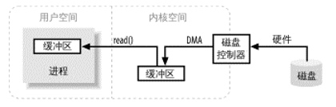

## 缓冲区操作

### 缓冲区操作简图

 用户空间：常规进程所在区域，不能直接访问硬件设备。
 
 内核空间：操作系统所在区域，所有I/O都直接或间接通过内核空间。
 
 请求I/O操作过程：系统调用 --> 内核 --> 传送数据到用户空间 --> 如果数据不在内核空间，则进程被挂起，内核着手把数据读进内存。
 
 注意：硬件通常不能直接访问用户空间，内核负责数据的分解，再组合工作，充当着中间人的角色。
 
### 发散/汇聚

 
 

