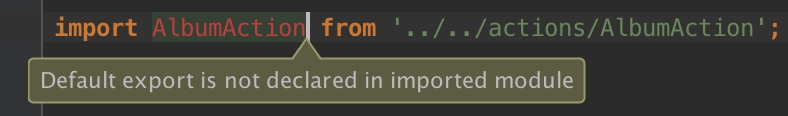

# 通过babel编译ES6

[Trying out JavaScript ES6 using Babel](https://onsen.io/blog/trying-out-javascript-es6-using-babel/)

# 编译器模块引入问题
    
在使用IDEA的是，如果通过类似这样的方式导出模块：

```javascript
module.exports = AlbumAction;
```

而通过ES6的模块机制进行引入

```javascript
import AlbumAction from '../../actions/AlbumAction.js';
```

这个时候IDEA会提示如下错误:



```
Default export is not declared in imported module
```

好像目前的IDEA(15.0.1)并不能识别兼容混用两种模块使用方式，尝试将导出代码也换成ES6的模块机制的方式，不再报这个错误了：

```javascript
export default AlbumAction;
```

# References

[WebStorm says that AppActions is not declared in imported module](https://github.com/darul75/web-react/issues/14)

[ES6详解八：模块（Module）](http://blog.csdn.net/lihongxun945/article/details/49031383)

[module.exports 还是 exports？](http://zihua.li/2012/03/use-module-exports-or-exports-in-node/)

[node.js的module.export 和 export方法的区别](http://blog.csdn.net/cike110120/article/details/12753253)


