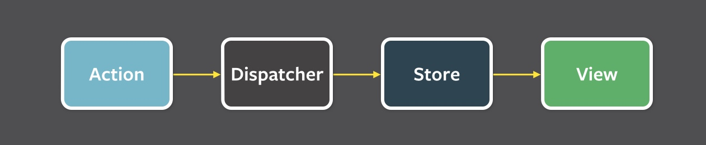

# Flux概述

Flux是Facebook用来构建用户端的web应用的应用程序体系架构。它通过利用数据的单向流动为React的可复用的视图组件提供了补充。相比于形式化的框架它更像是一个架构思想，不需要太多新的代码你就可以马上使用Flux构建你的应用。

Flux应用主要包括三部分：dispatcher、store和views（React components），千万不要和MVC(model-View-Controller)搞混。Controller在Flux应用中也确实存在，但是是以controller-view的形式。view通常处于应用的顶层，它从stores中获取数据，同时将这些数据传递给它的后代节点。另外，action creators - dispatcher辅助方法 - 一个被用来提供描述应用所有可能存在的改变的语义化的API。把它理解为Flux更新闭环的第四个组成部分可以帮助你更好的理解它。

Flux使用单向的数据流动来避开MVC. 当用户与React视图交互的时候，视图会通过中枢dispatcher产生一个action。然后大量的保存着应用数据和业务逻辑的视图接收到冒泡的action，更新所有受影响的view。这种方式很适合React这种声明式的编程方式，因为它的store更新，并不需要特别指定如何在view和state中过渡。

我们独创性的解决了数据的获取：举个栗子，比如我们需要展示一个会话列表，高亮其中未读的会话，同时展示未读会话的数量。如果用MVC架构的话将很难处理这种情况，因为更新一个对话为已读的时候会更新对话model，然后同样也需要更新未读对话数量model（数量-1）。这样的依赖和瀑布式的更新在大型的应用中非常常见，导致错综复杂的数据流动和不可预测的结果。（这其实是Facebook之前的一个线上bug，有时候用户看到提示说有一条未读信息，但是点进去却发现没有）。

反过来让 Store 来控制：store接受更新，并在合适的时机处理这些更新。而不是采用一贯依赖外部的方式来更新数据。在store外部，并没办法看到store内部是如何处理它内部的数据的，这样的方式保证了一个清晰的关注点分离。Store并没有类似setAsRead()这样直接的setter方法，但是在其自成一体的世界中拥有唯一个获取新数据的方法 - store通过dispatcher注册的回调函数。

## Structure and Data Flow 

Flux中数据是单项流动的：

用户的交互可能会使views产生新的action。

## A Single Dispatcher

dispatcher 就像是一个中央的集线器，管理着所有的数据流。本质上它就是 store callback 的注册表，本身并没有实际的高度功能。它就是一个用来向stores分发actions的机器。 每一个 store 各自注册自己的 callback 以提供对应的处理动作。当 dispatcher 发出一个 action 时，应用中所有的store都会通过注册的callback收到这个action。

## Stores

Stores 包含了应用的状态和逻辑。

store在dispatcher中注册，并提供相应的回调。

store更新完成之后，会向应用中广播一个change事件，views可以选择响应事件来重新获取新的数据并更新。

## Views and Controller-Views

React提供了一种可组合式的view让我们可以自由组合展示层。在接近顶层的地方，有些view需要监听所依赖的store的广播事件。我们称之为controller-view，因为他们提供了胶水代码来从store中获取数据，并向下层层传递这些数据。我们会利用这些controller-views来处理页面上某些重要部分。

## Actions

dispatcher提供了一个可以允许我们向store中触发分发的方法，我们称之为action。

## What About that Dispatcher? 

dispatcher也可以用来管理store之间的依赖。

# Flux TodoMVC Tutorial

